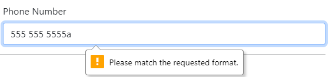
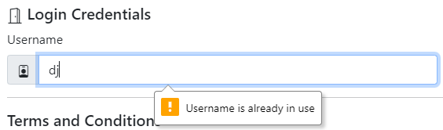
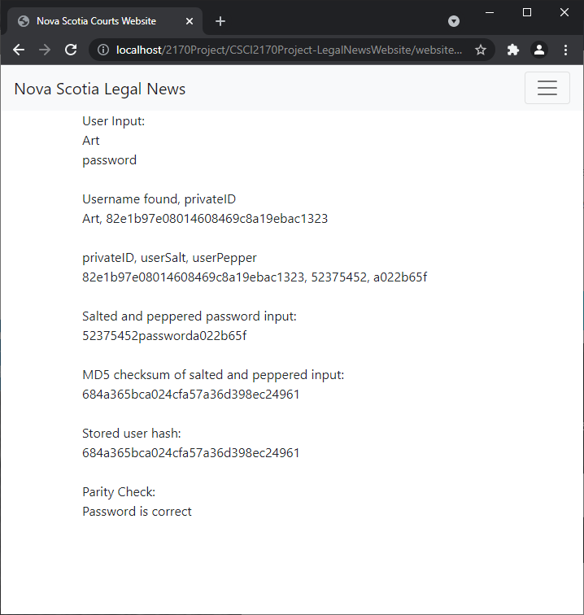

### Nova Scotia Court News Website

#### Early concept homepage design:


--- 

### Contributors:

- Adam Melvin 
- Liam Osler 
- Rachel Woodside
---

### How to use our website:
- Nova Scotia Legal News is a one-stop shop for court decisions and legal news articles. Recent rulings are pulled from the courts of Nova Scotia and presented to the public in a user friendly manner. We also host articles regarding Nova Scotia law, written by verified journalists and legal professionals.
- Our website also allows users to interact with the law by creating accounts, commenting on decisions/articles, and being able to follow other users.
- On our frontpage we present some recent rulings/articles, as well as a search bar to look for specific articles. We also have an advance search feature that lets users search articles by title, author or contents.

---

### Contributions:

- Milestone 1: Adam, Liam and Rachel all participated in brainstorming website goals and structure. Adam, Liam and Rachel each wrote up 2-3 user stories. Liam formatted the final planning document and generated prototype images of the webpage.

- Milestone 2: Adam, Liam and Rachel all participated in the conceptual design of the website. Rachel compiled the design plan into the wireframes and annotated them, with feedback from Adam and Liam.

- Milestone 3: Liam designed and set up the database and wrote the skeleton code for the website. Rachel implemented the contact form and comment posting features. Liam implemented the user login and user registration. Adam designed and wrote about.php and footer.php. Liam, Rachel and Adam all contributed to troubleshooting and polishing the website.
---

### Website goals: 

- Aggregate rulings from the Courts of Nova Scotia, present them in an accessible and easy to read fashion for users from a broad range of demographics.
- Index page "newsfeed" that aggregates sources such as the Courts of Nova Scotia's RSS Feed, CanLII's Nova Scotia RSS Feeds and other local news outlets for stories relevant to the court rulings and legislation in Nova Scotia.
- Means for users to add comments and/or reactions to the content on the Index page.
- Means for users to "follow" a certain topic, ruling, user, or other items.
- Provide a forum for discussions about Nova Scotia court rulings, legislation and legal affairs.

---

### Website Users: 

- #### Administrators:
    - Elevated user privileges
    - Manages other user accounts
    - Manages moderators and users
    
- #### Moderators:
    - Moderates discussion boards
        - May hide content as deemed appropriate by the terms of acceptable behaviour outlined in the user agreement to terms and conditions.

- #### Registered users (general users or not yet verified users):
    - Anyone can register for account
        - Must agree to terms and conditions during registration
        - User can upload a profile picture that creates their user icon
    - Can follow a topic or a ruling
    - Has a userpage that displays the user's activity feed
        - Items the user has commented on
        - Items the user has reacted to
        - Activity feed can be set to public/private according to user preference 

- #### Verified users (Law professionals, politicians, journalists, etc.)
    - Must be verified by the website (akin to Twitter verification)
        - User icon shows a verification symbol
        - Same features as registered users, but may also publish opinion pieces/articles/announcements 

---

### Technology Stack:
- PHP
- MySQL
- JavaScript
- CSS
- Libraries:
    - [Bootstrap 4.0](https://getbootstrap.com/docs/4.0/getting-started/introduction/)


### Database Schema:


## Sample Code:

### Registering users


```php
<?php
include "db/db.php";
include "db/functions.php"; 

session_name('legalnews');
session_start();

//Before proceeding, ensure that the posted values are valid for entry in to database:
$registrationValid = TRUE;
$email = sanitizeData($_POST["email"]);
$resultCount = 0;
if (strlen($email)>0) {
    $querySQL = "   SELECT `emailAddress`
                    FROM `users`
                    WHERE `emailAddress` = '{$email}'";
    $result = $dbconn->query($querySQL);

    foreach($result as $current){
        $resultCount+=1;
    }
}

//If the email address exists:
if($resultCount > 0){
    $registrationValid = FALSE;
}

$username = sanitizeData($_POST["username"]);
$resultCount = 0;
if (strlen($username)>0) {
    $querySQL = "   SELECT userName, userID 
                    FROM users
                    WHERE `userName` = '{$username}'";
    $result = $dbconn->query($querySQL);

    foreach($result as $current){
        $resultCount+=1;
    }
}

//If the username address exists:
if($resultCount > 0){
    $registrationValid = FALSE;
}

//Otherwise let the user register:
if($registrationValid == TRUE){
    $password = sanitizeData($_POST["password"]);
    $fName = sanitizeData($_POST["fName"]);
    $lName = sanitizeData($_POST["lName"]);
    $street = sanitizeData($_POST["street"]);
    $city = sanitizeData($_POST["city"]);
    $zip = sanitizeData($_POST["zip"]);

    $querySQL = "   INSERT INTO `users` VALUES
                    (NULL, MD5(UUID()), '{$username}', '{$fName}', '{$lName}', '{$email}', CURRENT_TIMESTAMP, TRUE, TRUE)";

    $result = $dbconn->query($querySQL);

    $querySQL = "   SELECT userName, userID, privateID
                    FROM users
                    WHERE `userName` = '{$username}'";
    $result = $dbconn->query($querySQL);

    foreach($result as $current){
        $_SESSION["userID"] = $current["userID"];

        $privateID = $current["privateID"];
        $querySQL = "   INSERT INTO `userSaltAndPepper` VALUES 
                        ('{$privateID}', LEFT(MD5(UUID()), 8), LEFT(MD5(UUID()), 8))
                    ";
        $dbconn->query($querySQL);

        $querySQL = "   SELECT `userSalt`, `userPepper`, `privateID`
                        FROM userSaltAndPepper
                        WHERE `privateID` = '{$privateID}'";
        $saltresult = $dbconn->query($querySQL);

        foreach($saltresult as $saltcurrent){
            $userSalt = $saltcurrent["userSalt"];
            $userPepper = $saltcurrent["userPepper"]; 
            
            $querySQL = "   INSERT INTO `userHashes` VALUES
                            ('{$privateID}', MD5(CONCAT('{$userSalt}', MD5('{$password}'), '{$userPepper}')))
                            ";
                        

            $_SESSION["userName"] = $username;

            $dbconn->query($querySQL);
            $dbconn->close();
        }
    }

}
header("Location: index.php");
?>
```
### Checking that inputs conform to standards:


```php
    <div class="col-md-6 mb-6">
        <label for="validationPhone">Phone Number</label>
        <input type="phone" class="form-control" name = "phone" id="validationPhone" placeholder="Phone Number" pattern="^([0-9]{3})-?\s?([0-9]{3})-?\s?([0-9]{4})$" value="" required>
    </div>
```

### Validating emails are unique:

```php
<?php
$xmlDoc=new DOMDocument();
$x=$xmlDoc->getElementsByTagName('link');

//get the q parameter from URL
$email = sanitizeData($_GET["email"]);
$resultCount = 0;

//If the query is not empty:
if (strlen($email)>0) {
    $querySQL = "   SELECT `emailAddress`
                    FROM `users`
                    WHERE `emailAddress` = '{$email}'";
    $result = $dbconn->query($querySQL);

    foreach($result as $current){
        $resultCount+=1;
    }
}
if($resultCount > 0){
    echo "Email is already taken";
}
else{
    echo "Email is valid";
}
?>
```

### Checking that usernames are unique:

```php

<?php
$xmlDoc=new DOMDocument();
$x=$xmlDoc->getElementsByTagName('link');

$username = sanitizeData($_GET["username"]);
$resultCount = 0;

if (strlen($username)>0) {
    $querySQL = "   SELECT userName, userID 
                    FROM users
                    WHERE `userName` = '{$username}'";
    $result = $dbconn->query($querySQL);

    foreach($result as $current){
        $resultCount+=1;
    }
}
if($resultCount > 0){
    echo "Username is already taken";
}
else{
    echo "Username is valid";
}
?>
```

### Creating test users in MySQL:
Three tables will be used for the login process, the users table, the userSaltAndPepper table and the userHashes table. The userHashes table contains the  
```sql
CREATE TABLE users (
    userID int AUTO_INCREMENT,
    privateID varchar(255),
	userName varchar(255),
	firstName varchar(255),
    lastName varchar(255),
	emailAddress varchar(255),
	registrationDate datetime,
    verificationStatus bool,
    profileVisibility bool,
    PRIMARY KEY (userID),
	INDEX NAME (privateID)
);

CREATE TABLE userSaltAndPepper(
	privateID varchar(255),
    userSalt varchar(32),
    userPepper varchar(32),
    PRIMARY KEY (privateID),
    FOREIGN KEY (privateID) REFERENCES users(privateID)
    );
    
CREATE TABLE userHashes(
	privateID varchar(255),
	passwordHash varchar(32),
    PRIMARY KEY (privateID),
    FOREIGN KEY (privateID) REFERENCES users(privateID)
    );
```

Note: the user has both a public "userID", which is a simple incremental value used for the purposes of posting content on the website, and for following other users. The user also has a "privateID" which is used only for the password related purposes.

### Creating some test user accounts
Format for insertion is userID (auto incremented so left as null), privateID (randomized string using UUID()), username, first name, last name, email address, time of registration (uses current_timestamp), the user's verification status (true or false), and the user's provile visibility setting (true or false).
```sql
INSERT INTO `users` VALUES
(NULL, MD5(UUID()), "Site Administator", "", "", "admin@novascotialegalnews.ca", CURRENT_TIMESTAMP, TRUE, TRUE),
(NULL, MD5(UUID()), "Art", "Arthur", "Kirkland", "kirkland@novascotialegalnews.ca", CURRENT_TIMESTAMP, TRUE, TRUE),
(NULL, MD5(UUID()), "Frank", "Francis", "Rayford", "rayford@novascotialegalnews.ca", CURRENT_TIMESTAMP, TRUE, TRUE),
(NULL, MD5(UUID()), "Henry", "Henry", "Fleming", "fleming@novascotialegalnews.ca", CURRENT_TIMESTAMP, TRUE, TRUE),
(NULL, MD5(UUID()), "JayP", "Jay", "Porter", "jayp@gmail.com", CURRENT_TIMESTAMP, TRUE, TRUE),
(NULL, MD5(UUID()), "DJ", "Dave", "Jameson", "dj@gmail.com", CURRENT_TIMESTAMP, TRUE, TRUE),
(NULL, MD5(UUID()), "Windy", "Gail", "Packer", "windy12345@yahoo.com", CURRENT_TIMESTAMP, TRUE, TRUE);
```

### Creating some salt and pepper values for test accounts in SQL:
Once the test accounts have been added to the database, we can generate random a salt and pepper value for each of the users. In this case I have trimmeda random UUID to 8 characters using ```LEFT(MD5(UUID()), 8)```

```sql
-- Create some random fake salt and pepper values for all the users:
INSERT INTO `userSaltAndPepper`(privateID, userSalt, userPepper)
SELECT privateID, LEFT(MD5(UUID()), 8), LEFT(MD5(UUID()), 8)
FROM `users`;
```

### Hashing the salt and pepper values together with a password
```sql
-- Concat the user salt and peppers together with the word "password" then calculate their MD5 checksum and set it to the user's passwordHash:
INSERT INTO `userHashes`(privateID, passwordHash)
SELECT privateID, MD5(CONCAT(userSalt, "password", userPepper))
FROM `userSaltAndPepper`;
```

### User enters their password in the login modal:


### Password input check salting routine (with print output) in PHP:
```php
<?php
    $usernameInput = sanitizeData($_POST["username"]);
    $passwordInput = sanitizeData($_POST["password"]);

    echo "User Input:";
    echo "<br>";
    echo($usernameInput);
    echo "<br>";
    echo($passwordInput);

    $querySQL = "   SELECT userName, privateID from users 
                    WHERE userName = '{$usernameInput}'";
    $result = $dbconn->query($querySQL);
    $rowcount = mysqli_num_rows($result); 
    echo "<br>";

    if($rowcount < 1){
        echo("Username or Password Incorrect");
    }  
    else{
        foreach($result as $current){
            $privateID = $current["privateID"];
            echo "<br>";
            echo("Username found, privateID " );
            echo "<br>";
            echo($current["userName"] . ", " . $privateID );
            echo "<br>";

            //Get the user's salt and peppers for password spicing:
            $querySQL = "   SELECT privateID, userSalt, userPepper from userSaltAndPepper 
                            WHERE privateID = '{$privateID}'";
            $result = $dbconn->query($querySQL);

            foreach($result as $current){
                $userSalt = $current["userSalt"];
                $userPepper = $current["userPepper"] ;
                echo "<br>";
                echo("privateID, userSalt, userPepper" );
                echo "<br>";
                echo($current["privateID"] . ", " . $current["userSalt"] . ", " . $current["userPepper"] );
                
                echo "<br>";
                echo "<br>";
                echo("Salted and peppered password input:" );
                $saltAndPepperPasswordInput = $userSalt . $passwordInput . $userPepper;
                echo "<br>";
                echo($saltAndPepperPasswordInput);
                
                echo "<br>";
                echo "<br>";
                echo("MD5 checksum of salted and peppered input:" );
                echo "<br>";
                $saltAndPepperPasswordInputChecksum = md5($saltAndPepperPasswordInput);
                echo($saltAndPepperPasswordInputChecksum);

                //Get the user's password from the database:
                $querySQL = "   SELECT privateID, passwordHash from userHashes
                                WHERE privateID = '{$privateID}'";
                $result = $dbconn->query($querySQL);
                foreach($result as $current){
                    $passwordHash = $current["passwordHash"];
                    echo "<br>";
                    echo "<br>";
                    echo("Stored user hash:" );
                    echo "<br>";
                    echo($passwordHash);
                }

            }
        }
        echo "<br>";
        echo "<br>";
        echo("Parity Check:");
        echo "<br>";
        if($saltAndPepperPasswordInputChecksum == $passwordHash){
            echo "Password is correct";
        }else{
            echo "Username or Password Incorrect";
        }
    } 
?>
```

### The output of the code above when the password is correct:

### The output of the code above when the password is incorrect:

### Explanation:
1. The user's input is displayed (as shown in the figure above, "Art" is the username and "password" is the password)
2. The database is queried for the username, and if it is found the username and the user's privateID are displayed. If the username is not found the string "Username or Password Incorrect" is displayed.
3. The user salt and pepper table is queried for the privateID, and the privateID, the userSalt and the userPepper are displayed on the screen.
4. The user's salt is concatenated to the password input (in this case just the word "password", as above) and the user's pepper, which is written as  ``` $saltAndPepperPasswordInput = $userSalt . $passwordInput . $userPepper;``` in the code above.
5. This salt and peppered password is hashed with MD5
6. The userHash database is queried using the username's corresponding privateID and the stored password hash is displayed.
7. A parity check is performed. If the checksum of the salted and peppered input matches the stored password hash, "Password is correct" is displayed. If not "Username or Password is Incorrect" is displayed.

### The same code without console logging:
```php
<?php
    //Sanitize the username and password input:
    $usernameInput = sanitizeData($_POST["username"]);
    $passwordInput = sanitizeData($_POST["password"]);

    //Query the users table for the username
    $querySQL = "   SELECT userName, userID, privateID from users 
                    WHERE userName = '{$usernameInput}'";
    $result = $dbconn->query($querySQL);
    $rowcount = mysqli_num_rows($result); 

    //If the username isn't found no rows will be returned
    if($rowcount < 1){
        //If no username found then Set the username or password incorrect value to TRUE
        $incorrect = TRUE;
    }  
    else{
        //Get the first result as the current item:
        foreach($result as $current){
            //Set the userID, userName and privateID to their own variables:
            $userID = $current["userID"];
            $userName = $current["userName"];
            $privateID = $current["privateID"];
            //Get the user's salt and peppers for password spicing:
            $querySQL = "   SELECT privateID, userSalt, userPepper from userSaltAndPepper 
                            WHERE privateID = '{$privateID}'";
            $result = $dbconn->query($querySQL);

            //Get the first result as the current item:
            foreach($result as $current){
                //Set the user's salt and peppers to their own variables:
                $userSalt = $current["userSalt"];
                $userPepper = $current["userPepper"] ;
                //Conatenate the salt, password input and the pepper together
                $saltAndPepperPasswordInput = $userSalt . $passwordInput . $userPepper;
                //Get the MD5 checksum of $saltAndPepperPasswordInput and set it to a variable:
                $saltAndPepperPasswordInputChecksum = md5($saltAndPepperPasswordInput);

                //Get the user's hashed password (with salt and pepper) from the database:
                $querySQL = "   SELECT privateID, passwordHash from userHashes
                                WHERE privateID = '{$privateID}'";
                $result = $dbconn->query($querySQL);
                foreach($result as $current){
                    //Set the user's hashed password to variable:
                    $passwordHash = $current["passwordHash"];
                }

            }
        }
        //Check if the hashed input matches the user's hashed password:
        if($saltAndPepperPasswordInputChecksum == $passwordHash){
            //If the password is correct, we can set the SESSION userName and userID values:
            $_SESSION["userName"] = $userName;
            $_SESSION["userID"] = $userID;
            //Redirect the user 
            header("Location: index.php");

        }else{
            //If password incorrect then Set the username or password incorrect value to TRUE
            $incorrect = TRUE;
        }
    }
    if($incorrect){
        ?> 
            <!--HTML CODE to enter a different password or username  -->
        <?php
    } 
?>    
```
### When the user logs in successfully, the text in the login button is replaced with "My Profile" and an option to "Logout" is shown with an open door icon: 


### Citations
1.  Title: UXPin 
    URL: https://www.uxpin.com/
    Use: Developing and annotating wireframes
    Date Accessed: 09 Nov 2021
    Purpose: Developing and annotating wireframes
2.  Title: W3Schools HTML Input Types
    URL: https://www.w3schools.com/html/html_form_input_types.asp
    Date Accessed: 27 Nov 2021
    Purpose: Reviewed use of different types of input to generate an advanced search interface
3.  Title: Forms Bootstrap
    URL: https://getbootstrap.com/docs/4.1/components/forms/#checkboxes-and-radios
    Date Accessed: 27 Nov 2021
    Purpose: Referred to existing Bootstrap framework styling mechanisms for radio type inputs
4.  Title: How To Create A Login System In PHP For Beginners | Procedural MySQLi | PHP Tutorial
    URL: https://youtube.com/watch?v=gCo6JqGMi30&t=0s
    Date Accessed: 05 Dec 2021
    Purpose: Used some concepts such as prepared statements and error checking
5.  Title: W3Schools PHP Sessions
    URL: https://www.w3schools.com/php/php_sessions.asp
    Date Accessed: 07 Dec 2021
    Purpose: Review of PHP session variables
6.  Title: W3Schools PHP MySQL Insert Multiple Records
    URL: https://www.w3schools.com/php/php_mysql_insert_multiple.asp
    Date Accessed: 04 Dec 2021
    Purpose: Review of SQL INSERT statements
7.  Title: Magic Pattern - CSS Backgroun Patterns
    URL: https://www.magicpattern.design/tools/css-backgrounds
    Date Accessed: 01 Dec 2021
    Purpose: Checking out CSS sstyling possibilities 
8.  Title: How To Submit AJAX Forms with JQuery
    URL: https://www.digitalocean.com/community/tutorials/submitting-ajax-forms-with-jquery
    Date Accessed: 27 Nov 2021
    Purpose: Review AJAX form submission
9.  Title: Github - LiamOsler/foodfeed
    URL: https://github.com/LiamOsler/foodfeed
    Date Accessed: 23 Nov 2021
    Purpose: Referencing previous use of registration/login features.
10. Title: Github - LiamOsler/Halifax-Housing-Hackathon
    URL: https://github.com/LiamOsler/Halifax-Housing-Hackathon/tree/master
    Date Accessed: 27 Nov 2021
    Purpose: Referencing user registration features.
11. Title: Password Hashing, Salts, Peppers | Explained!
    URL: https://www.youtube.com/watch?v=--tnZMuoK3E&ab_channel=Seytonic
    Date Accessed: 27 Nov 2021
    Purpose: Reviewing Salt and Pepper hashing.
12. Title: Hashing vs Encryption Differences
    URL: https://www.youtube.com/watch?v=GI790E1JMgw&ab_channel=ProgrammingwithProfessorSluiter
    Date Accessed: 27 Nov 2021
    Purpose: Reviewing password authentication.
    
